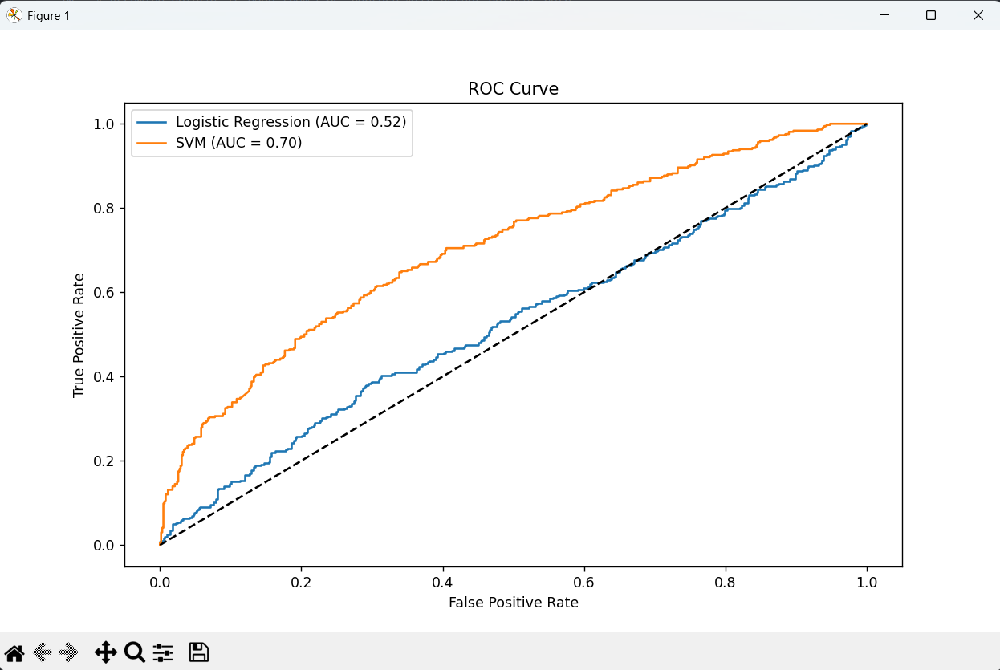

This repo contains the following ML projects:

1. [Water Potability Prediction](#water-potability-prediction)
2. [Employee Turnover Prediction](#employee-turnover-prediction)
3. [Sales Prediction Based on Ad Spend](#sales-prediction-based-on-ad-spend)
4. [Diabetes Prediction Model](#diabetes-prediction-model)

# Water Potability Prediction

This project aims to classify water samples as potable (drinkable) or non-potable using machine learning models. It compares the performance of different models using the Receiver Operating Characteristic (ROC) curve.

## Overview

The project builds two main models:

- **Logistic Regression**
- **Support Vector Machine (SVM)**

The performance of these models is evaluated using ROC curves and their respective Area Under the Curve (AUC) scores.

## ROC Curve Analysis

The ROC curve is used to evaluate the performance of the classification models by plotting the **True Positive Rate (TPR)** against the **False Positive Rate (FPR)**. A better performing model will have a curve that hugs the top-left corner of the graph, indicating high sensitivity with a low false positive rate.

In this project, we compared the performance of Logistic Regression and SVM models. Below is a summary of the results:

### ROC Curve



### Key Results:

- **Logistic Regression:**
  - AUC: **0.52**
  - Performance: The Logistic Regression model's AUC score suggests it is not significantly better than random guessing.
- **Support Vector Machine (SVM):**
  - AUC: **0.70**
  - Performance: The SVM model performs better than Logistic Regression, with acceptable discriminatory power between the positive and negative classes.

### Interpretation:

- An **AUC of 0.5** represents a model with no discriminatory power (random).
- An **AUC of 0.7** indicates acceptable performance, which suggests that SVM is a better model for this task in comparison to Logistic Regression.

## Requirements

To run the project, install the necessary dependencies by running:

```bash
pip install -r requirements.txt
```

To run the project after installing the necessary dependencies

```bash
python water_potability.py
```

# Employee Turnover Prediction

This project aims to predict whether employees will leave the company using two machine learning models: **Logistic Regression** and **Support Vector Machine (SVM)**. The dataset is preprocessed, cleaned, and then used to train and evaluate the models.

## Table of Contents

1. [Overview](#overview)
2. [Dataset](#dataset)
3. [Final Accuracy Results](#final-accuracy-results)
4. [Features](#features)
5. [How to Run the Project](#how-to-run-the-project)

## Overview

The project involves predicting employee turnover using a dataset with features like:

- **Satisfaction Level**
- **Last Evaluation**
- **Number of Projects**
- **Average Monthly Hours**
- **Time at Company**
- **Department** (encoded)
- **Salary** (encoded)

The target variable (`left`) indicates whether the employee left the company.

## Dataset

The dataset is downloaded from the following link:

https://drive.google.com/uc?id=1g1nwk4k-h9FceEHKZc8ocfu_xp3xnZ8R

The dataset contains various employee attributes such as:

- **satisfaction_level**
- **last_evaluation**
- **number_of_projects**
- **average_montly_hours**
- **time_spent_at_company**
- **Department** (Categorical)
- **Salary** (Categorical)
- **left** (Target variable, 1 if the employee left, 0 otherwise)

### Features:

- **satisfaction_level**: Employee satisfaction level
- **last_evaluation**: Last evaluation score
- **number_of_projects**: Number of projects completed
- **average_montly_hours**: Monthly working hours
- **time_spent_at_company**: Time spent at the company in years
- **Department**: Employee's department (Categorical)
- **Salary**: Salary category (Categorical)
- **left**: Whether the employee left the company (Target)

### How to run the project

To run the project, install the necessary dependencies by running:

```bash
pip install -r requirements.txt
```

Run the project after installing the necessary dependencies

```python
python hr.py
```

# Sales Prediction Based on Ad Spend

This is a Streamlit-based web app that predicts sales based on advertising spend in various media channels (TV, Radio, and Newspaper). It supports both single and multiple feature predictions using **Linear Regression** and **Support Vector Regression (SVR)** models.

## Table of Contents

- [Overview](#overview)
- [Features](#features)
- [Usage](#usage)
- [How to Run Locally](#how-to-run)

## Overview

This application allows users to predict sales based on advertising expenditure. It accepts a CSV file as input, and the user can select between **Linear Regression** and **SVR** models for prediction. The app also supports both single feature (TV ad spend) and multiple feature (TV, Radio, and Newspaper ad spend) predictions.

## Features

- Upload a CSV file to analyze the data.
- Preview the first few rows of the dataset.
- Choose between two models:
  - **Linear Regression**
  - **Support Vector Regression (SVR)**
- Choose between:
  - **Single feature prediction** using only the TV ad spend.
  - **Multiple feature prediction** using TV, Radio, and Newspaper ad spend.
- Interactive sliders to adjust ad spend for predictions.
- Predict sales based on the selected model and feature set.

## Usage

1. Upload a CSV file containing columns like `TV`, `radio`, `newspaper`, and `sales`.
2. The app allows you to:
   - Choose a model: **Linear Regression** or **SVR**.
   - Choose whether to use a single feature (`TV` ad spend) or multiple features (TV, Radio, and Newspaper ad spend).
3. Use the sliders to select the ad spend values for TV, Radio, and Newspaper.
4. View the predicted sales output.

### Input CSV Example

The CSV file should have at least the following columns:

- `TV`: TV ad spend (in $)
- `sales`: The resulting sales (in millions of dollars)

If you want to use multiple features for prediction, include these additional columns:

- `radio`: Radio ad spend (in $)
- `newspaper`: Newspaper ad spend (in $)

Example:

| TV    | radio | newspaper | sales |
| ----- | ----- | --------- | ----- |
| 230.1 | 37.8  | 69.2      | 22.1  |
| 44.5  | 39.3  | 45.1      | 10.4  |
| 17.2  | 45.9  | 69.3      | 9.3   |
| ...   | ...   | ...       | ...   |

## How to Run

To run the project, install the necessary dependencies by running:

```bash
pip install -r requirements.txt
```

After installing the necessary dependencies, run the project

```python
stremlit run ads.py
```

# Diabetes Prediction Model

This project applies machine learning techniques to predict whether a patient has diabetes based on various health parameters. Two classification models, **Logistic Regression** and **Support Vector Machine (SVM)**, are trained and evaluated for their performance on the Pima Indians Diabetes Dataset.

## Table of Contents

- [Overview](#overview)
- [Features](#features)
- [Dataset](#dataset)
- [Evaluation](#evaluation)
- [How to Run Locally](#how-to-run)

## Overview

This project aims to predict diabetes based on diagnostic measurements from patients. The dataset consists of various health-related parameters like glucose levels, blood pressure, BMI, insulin levels, etc.

Two machine learning models are used for classification:

- **Logistic Regression**
- **Support Vector Machine (SVM)**

## Features

- **Data Preprocessing**: Missing values are handled, and certain columns with zeros are replaced by the median value.
- **Exploratory Data Analysis**: A correlation heatmap is plotted to identify relationships between features.
- **Modeling**: Logistic Regression and SVM are used for predicting diabetes.
- **Evaluation**: The performance of the models is evaluated using metrics like accuracy, confusion matrix, and ROC curve.
- **Visualization**: Confusion matrices and ROC curves are plotted for both models.

## Dataset

The dataset used is the [Pima Indians Diabetes Database](https://www.kaggle.com/uciml/pima-indians-diabetes-database), which consists of 768 instances and the following features:

- **Pregnancies**: Number of times pregnant
- **Glucose**: Plasma glucose concentration
- **BloodPressure**: Diastolic blood pressure (mm Hg)
- **SkinThickness**: Triceps skin fold thickness (mm)
- **Insulin**: 2-Hour serum insulin (mu U/ml)
- **BMI**: Body mass index (weight in kg/(height in m)^2)
- **DiabetesPedigreeFunction**: Diabetes pedigree function (a function that scores likelihood of diabetes based on family history)
- **Age**: Age in years
- **Outcome**: Class variable (0 or 1), where 1 means the patient has diabetes

### Handling Missing Values

Certain columns in the dataset contain zero values, which are not feasible (e.g., 0 for BMI or blood pressure). The columns:

- Glucose
- BloodPressure
- SkinThickness
- Insulin
- BMI

are replaced by the median value wherever a zero is encountered.

## How to Run

To run the project, install the necessary dependencies by running:

```bash
pip install -r requirements.txt
```

Install the necessary dependencies and run the project

```python
python diabetes.py
```
